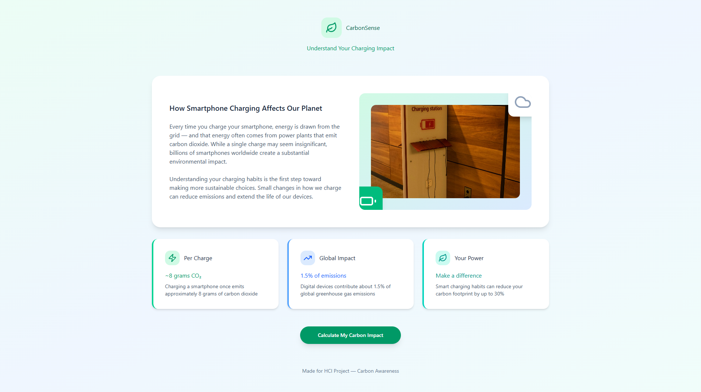
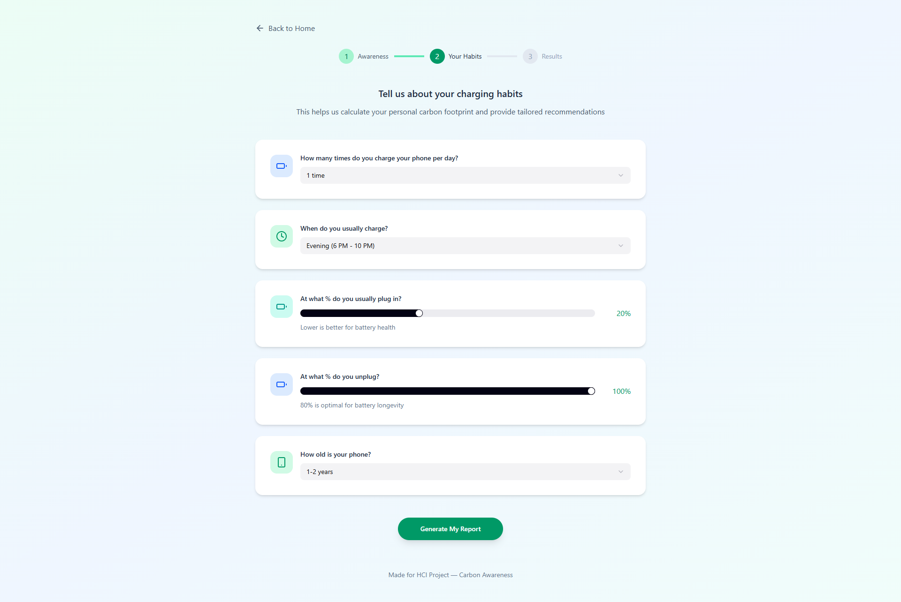
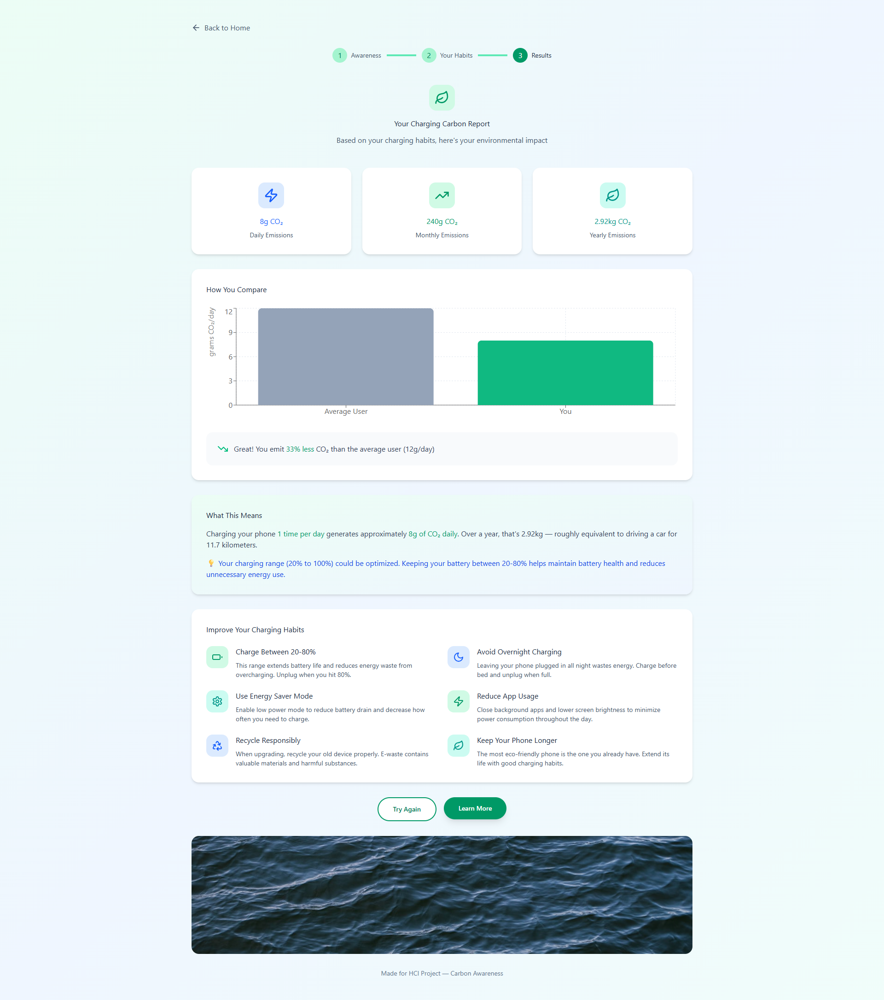

# CarbonSense: Understand Your Charging Impact

CarbonSense is a web application designed to help users understand and reduce the environmental impact of their smartphone charging habits. By answering a few simple questions, users can get a personalized carbon report and actionable tips to become more eco-friendly.

## Features

* **Educational Landing Page:** Informs users about the CO2 emissions associated with smartphone charging.
* **Personalized Questionnaire:** Gathers data on individual charging habits, such as frequency, timing, and battery levels.
* **Detailed Carbon Report:** Calculates and displays the user's daily, monthly, and yearly CO2 emissions from charging.
* **Comparative Analysis:** Shows users how their carbon footprint compares to the average.
* **Actionable Tips:** Provides practical advice on how to reduce emissions and improve battery health, such as charging between 20-80% and avoiding overnight charging.

## Application Flow & Screenshots

The user journey is simple and divided into three main steps:

### 1. Awareness

The landing page introduces the problem and its global impact, encouraging users to calculate their own footprint.

### 2. Your Habits

A simple questionnaire collects key data about the user's charging habits.

### 3. Results & Recommendations

A personalized report is generated, showing the user's carbon emissions and providing specific tips for improvement.

## Technology Stack

* **Frontend:** Vite + React, Tailwind CSS
* **Backend:** None
* **Database:** None

## Getting Started

1.  Clone the repository: `git clone ...`
2.  Install dependencies: `npm install`
3.  Run the application: `npm run dev`

---

*This project was created for IE403: HCI Project.*